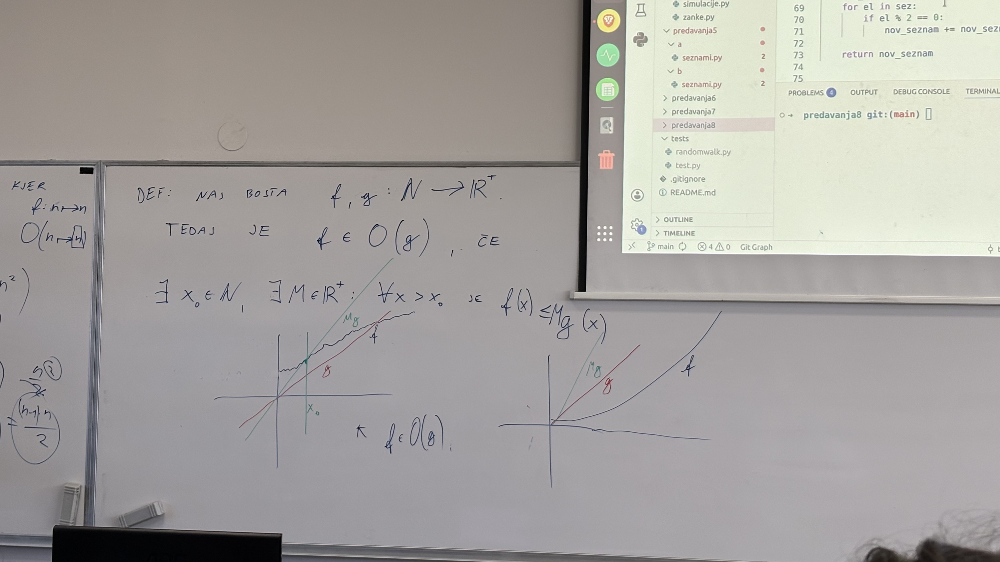

Ko poženemo nek program v Pythonu, nas ponavadi zanimata dva parametra:
1. koliko časa bo program porabil
2. koliko prostora bo program zasedel
Rečemo jima <span style="color:rgb(0, 176, 80)">časovna</span> in <span style="color:rgb(0, 176, 80)">prostorska</span> <span style="color:rgb(0, 176, 80)">zahtevnost</span>. 

Za nek algoritem ponavadi ne povemo konkretno čas, ki ga porabi za izvajanje na nekem računalniku (npr. 3 minute), ampak nas zanima <span style="color:rgb(0, 176, 240)">ocena</span>, koliko časa približno se bo program izvajal glede na to, kaj mu damo v algoritem (glede na input).

Gledamo torej, koliko osnovnih operacij je potrebnih za izvedbo programa (npr. seštevanje dveh števil, množenje dveh števil itd.)

Zanima nas v resnici, kako čas narašča v odvisnosti od našega inputa, torej "rast" časa. Če damo notri nek input z n elementi in nek input z 2n elementi, bi želeli vedeti, koliko časa porabi za vsakega od teh. V resnici kar gledamo je red velikosti oziroma katera elementarna funkcija najbolje opisuje rast časa z rastjo števila elementov (npr. linearno, kvadratno, logaritemsko, itd.)

Za odgovor na to oceno je bila izumljena <span style="color:rgb(0, 176, 80)">velika</span> <span style="color:rgb(0, 176, 80)">O</span> <span style="color:rgb(0, 176, 80)">notacija</span>. Programi potem tečejo npr. v času O($n$) ali O($n^2$), kjer je n velikost inputa (npr. število elementov v seznamu).

Primeri:
1. Produkt elementov
```python
def produkt_elementov(sez):
	produkt = 1
	for el in sez:
		produkt *= el
	return produkt
```

Vidimo, da pri for zanki za vsak element seznama sez naredi nekaj korakov. V tem primeru jih naredi konstantno mnogo. Zato ima ta funkcija čas O($n$), kjer je $n$ velikost seznama sez.

2. Največji element matrike:

Matrika je velikost nxn in moramo pogledati vse vrstice in vse elemente v vsaki vrstici. Čas je O($n^2$).

3. Seznam, ki izlušči samo sode elemente

```python
def sodi_elementi(sez):
	nov_seznam = []
	for j in sez:
		if j % 2 == 0:
		nov_seznam.append(j) # to se šteje kot ena operacija 
	return nov_seznam
```

To ima čas O(n), ker je za vsak element seznama sez samo eno operacijo.

```python
def sodi_elementi_pocasi(sez):
    nov_seznam = []
    for el in sez:
        if el % 2 == 0:
            nov_seznam = nov_seznam + [el]
    return nov_seznam
```

Tukaj pa je čas zdaj O($n^2$), ker vsakič gremo čez celoten nov seznam.
___
Opomba:
1. O notacija označuje <span style="color:rgb(0, 176, 240)">zgornjo</span> <span style="color:rgb(0, 176, 240)">mejo</span> - toliko bo maksimalno časa porabilo - pokrije ta <span style="color:rgb(0, 176, 240)">najslabši</span> <span style="color:rgb(0, 176, 240)">primer</span> - lahko se zgodi da dobimo kak boljši primer, odvisno, kaj damo notri v program kot input (npr. za sode elemente - če imamo samo liha števila v seznamu, bo program hitro končal, ker ni nobenih sodih števil in ni treba nič dodajati seznamu)
2. O notacija je ocena reda velikosti. Če program npr. rabi čas 1+2+...+n = n(n+1) / 2,bi to v O notaciji napisali kot O($n^2$).
___
Zdaj pa uradna definicija O notacije:

_Definicija_: Naj bosta $f, g : \mathbb{N} \rightarrow \mathbb{R}^+$. Tedaj je $f \in O(g)$, če $\exists x_{0} \in \mathbb{N}. \exists M \in \mathbb{R}^+: \forall x > x_{0}. f(x) \leq M\cdot g(x)$. Torej mi želimo neko lepo elementarno funkcijo g, da vemo da od neke točke $x_{0}$ naprej je funkcija f <span style="color:rgb(0, 176, 240)">vedno</span> pod funkcijo g, množeno z nekim $M$. Ne želimo, da funkcija f v neskončnosti prehiti funkcijo g. Ko bo od neke točke naprej f pod g, je potem $f \in O(g)$.




![[slika_table.jpeg]]

Spodaj primer dveh grafov - na levi smo dobro izbrali linearno funkcijo g, ker po neki točki bo vedno večja od f, na desni je pa f eksponentna funkcija in bo na neki točki vedno presegla g, ne glede na to, s čim g množimo - rabimo izbrati drugačen g.

Funkcija f je naš algoritem - funckija opisuje število izvedenih korakov v odvisnosti od velikosti inputa.
M ni važen, ker samo gledamo red velikosti.

___
Recimo, da imamo $f_{1} \in O(g_{1})$ in $f_{2} \in O(g_{2})$. Zanima nas, kako je omejeno $f_{1}+f_{2}$. Ker gledamo red velikosti, bo prevladala tista, ki bo bolj velika. Tudi če sta enaki, red velikosti ostane enak, zato lahko to omejimo z: $f_{1}+f_{2} \in O(max(g_{1},g_{2}))$.

Kaj pa če imamo $f_{1} \cdot f_{2}$? Potem je to omejeno z: $f_{1} \cdot f_{2} \in O(g_{1} \cdot g_{2})$. To se zgodi, ko imamo na primer skupaj dve for zanki ena v drugi: za vsako iteracijo zunanje for zanke $f_{1}$ se izvede celotna druga for zanka $f_{2}$. Zato bo časovna zahtevnost kar produkt teh dveh.

Primeri:
1. urejanje seznama - glej poglavje seznami
```python
def uredi(sez):
    if sez == []:
        return []

    nov_sez = sez.copy() # stane nas O(n)

    i = indeks_najvecjega(sez) # stane nas O(n) - sprehodimo se čez cel seznam

    del nov_sez[i] # stane O(n)

    urejen = uredi(nov_sez) # stane O(n-1), potem O(n-2)
    urejen.append(sez[i])

    return urejen
```

Tukaj najprej seštejemo te ta prve tri $O(n)$ in dobimo $O(n)$. Potem pa imamo še rekurzijo, ki za vsak korak porabi še en $O(n)$. V resnici potem seštejemo 1+2+...+n - časovna zahtevnost je potem $O(n^2)$.

2. Bubble sort

```python
def bubble_sort(sez):
    while True:
        so_urejeni = True
        for i in range(len(sez) - 1):
            if sez[i] > sez[i + 1]:
                sez[i], sez[i + 1] = sez[i + 1], sez[i]
                so_urejeni = False

        if so_urejeni:
            break
```

Omejitev je $O(n^2)$, ker gre v najslabšem primeru n-krat čez cel seznam.

3. Quicksort

```python
def quicksort(sez):
    if len(sez) <= 1:
        return sez

    indeks = random.randint(0, len(sez) - 1)
    pivot = sez[indeks]

    manjsi = []
    vecji = []
    for i in range(len(sez)):
        if i == indeks:
            continue
        el = sez[i]
        if el >= pivot:
            vecji.append(el)
        else:
            manjsi.append(el)

    return quicksort(manjsi) + [pivot] + quicksort(vecji)
```

Najslabša zadeva, kar se lahko zgodi, je, da pivot izberemo slabo - vedno na robu seznama - potem samo za 1 odštevamo velikost seznama, torej seštejemo n+n-1+n-2+...+1. Torej spet bo časovna zahtevnost $O(n^2)$. Lahko pa govorimo tudi o pričakovani časovni zahtevnosti, torej da bo ta pivot nekajkrat nekje na sredini. Potem bo časovna zahtevnost $O(n\cdot \log(n))$. Baza logaritma ni važna, vedno pišemo samo $\log$. 

___
Opomba:
1. Pogosto v dokumentaciji piše, kakšna je časovna zahtevnost kakih funkcij. Tudi Python ima isto v svoji dokumentaciji za svoje vgrajene funkcije.
___
Probajmo izračunati determinanto neke matrike v najbolj optimalni časovni zathevnosti.

```python
import random
def det(m):
	if len(m) == 1: # ustavitveni pogoj
		return m[0][0]
	d = 0
	# m je matrika n x n
	# dajmo narediti razvoj po prvi vrstici
	for i in range(len(m[0])): # stane nas O(n)
		d += m[0][i] * det(zbrisi(m, 0, i)) * (-1)**(i) # vsakič stane O(n^2)
	
	return d
	

def zbrisi(m, i, j): # zbrišemo i-to vrstico in j-ti stolpec
	nov_m = []
	for k in range(len(m)):
		if k != i:
			nov_m.append(m[k][:j]+ m[k][j+1:]) # v tistih vrsticah, ki jih dodamo, izbrišemo j-ti element, ker je v j-tem stolpcu
	return nov_m
# zbrisi nas stane O(n^2) - ker gremo čez celo matriko

# ustvarimo še naključno matriko
def nakljucna_matrika(n):
	return [[random.random() for _ in range(n)] for _ in range(n)] # naredi n nalkjučnih vrstic dolžine n - matrika n x n
```

Verjetnost, da je determinanta enaka 0 je zelo zelo majhna.

___
Opomba: če naša koda ne deluje, je verjetnost, da je računalnik kriv, zelo majhna
___

Kakšna pa je časovna zahtevnost te kode? Zahtevnost izbrisi je $O(n^2)$, tistega for loopa v det pa $O(n)$, vsakič ko gremo čez, se izvede rekurzija. Za prvič npr. potem imamo $O(n-1)$. Skupaj bo to $O(n) \cdot O(n-1) \cdot O(n-2) \dots$ oziroma $O(n!)$ (povprečno)

Dajmo probati izračunati determinanto z Gaussovimi eliminacijami, da dobimo zgornje trikotno matriko.

```python
def det_gauss(m):
	for i in range(len(m)): # zanka O(n)
		m_ii = m[i][i] # gledamo diagonalne
		if m_ii == 0:
			for j in range(i+1, len(m)): # zanka O(n)
				if m[j][i] != 0:
					m_ii = m[j][i]
					zamenjaj_vrstici(m, i, j) # to je O(1)
					zamenjave += 1
					break
			else: # else se izvede, če ni break
				return 0
				
		for j in range(i + 1, len(m)): # O(n)
			m_ji = m[j][i]
			m[j] = sestej_vrstici(m[j], m[i], -m_ji / m_ii)
	d = 1
	for i in range(len(m)):
		d *= m[i][i]
	
	return d * (-1) ** zamenjave
				
def sestej_vrstici(s1, s2, k):
	return [s1[i]+ k * s2[i] for i in range(len(s1))]

def zamenjaj_vrstici(m, i, j):
	m[i], m[j] = m[j], m[i]
					
```

Za časovno zathevnost samo zmnožimo te $O(n)$, torej dobimo, da je zahtevnost $O(n^3)$.